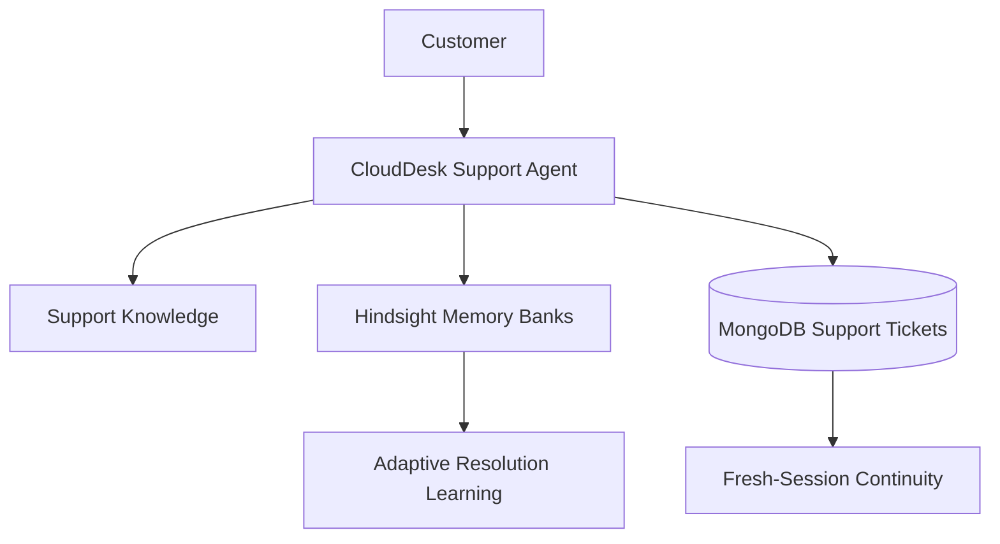

# How I Built a Support Agent That Remembers What Worked

## The Problem: Every Support Conversation Starts From Zero

Stateless support assistants treat each conversation as an isolated event. When a customer returns in a new session, the LLM retains no conversational context, forcing the customer to re-explain their environment and repeat failed troubleshooting steps.

Transcript stuffing hits context length limits and inflates inference costs with conversational noise. Similarly, basic vector search over chat transcripts retrieves what was discussed rather than what succeeded or failed. Technical support requires durable memory to retain structured context, track outcomes across sessions, respect communication preferences, and sustain unresolved ticket states.

<!-- SCREENSHOT TODO:
Add a screenshot of the CloudDesk support dashboard showing the polished
customer conversation, Hindsight status, and Customer Memory panel.
-->

## What I Wanted the Agent to Remember

Effective memory for technical support requires selective retention rather than chat logging. CloudDesk retains four categories:

1. **Customer Profile and Environment**: Operational context including tier (`pro`), cloud provider (`aws`), runtime (`docker`), and OS (`macos`).
2. **Troubleshooting Outcomes**: Historical records of diagnostic or remediation steps that succeeded or failed.
3. **Customer Preferences**: Communication styles such as conciseness, step-by-step guidance, or CLI formatting.
4. **Persistent Ticket Context**: Durable identifiers (`ticketId`), escalation states, severity, and diagnostic notes.

By isolating these categories, memory becomes actionable guidance that modifies future responses.

## Where Hindsight Fits

To deliver persistent memory across sessions, CloudDesk integrates [Vectorize agent memory](https://vectorize.io/what-is-agent-memory) powered by Hindsight. Integration patterns are documented in the [Hindsight documentation](https://hindsight.vectorize.io/) and the [Hindsight GitHub repository](https://github.com/vectorize-io/hindsight).

Hindsight provides managed memory bank infrastructure where facts and outcomes are retained and recalled through semantic queries. Tenancy is managed directly through distinct memory banks:

```javascript
// server/src/services/memory/hindsight.service.js
getBankId(customerId) {
  const sanitized = customerId.replace(/[^a-zA-Z0-9_-]/g, '_');
  return `customer_${sanitized}`;
}
```

Each customer is mapped to a separate Hindsight memory bank, so retention and recall operations are scoped to that customer's bank. When a customer initiates a conversation, the backend recalls contextual memories from their specific bank using semantic search.

## Learning From Successful and Failed Troubleshooting

Most memory implementations only record positive outcomes. In technical support, knowing what failed is equally critical to prevent repeating useless suggestions.

CloudDesk extracts support outcomes using deterministic pattern detection in `server/src/services/resolution/supportOutcome.service.js`. User messages are evaluated against positive patterns ("that worked", "fixed", "resolved") and negative failure patterns ("didn't work", "still failing", "error persists").

When an outcome is detected, CloudDesk generates structured outcome events:

- **SUCCESS**: Links the attempted solution with the root issue, marks resolution verified, and retains success in Hindsight.
- **FAILURE**: Records the attempted solution as ineffective, generates an avoidance directive, and retains failure in Hindsight.
- **REVERSAL**: If a previously successful approach later fails, the service updates the memory profile so the agent avoids it.

<!-- SCREENSHOT TODO:
Add a screenshot showing Learned Support Behavior with a previously
successful approach and a previously failed/avoided approach.
-->

## Turning Memory Into Adaptive Troubleshooting

Memory provides practical utility when it directly changes the agent's downstream behavior. CloudDesk implements adaptive resolution logic in `server/src/services/resolution/adaptiveResolution.service.js` and `server/src/services/agent/agent.service.js`.

When a customer reports an issue, the system queries Hindsight for historical outcomes linked to that topic. Attempted solutions are classified into prioritizations or avoidances. The agent then injects an explicit adaptive directive into the LLM system prompt:

```javascript
// server/src/services/agent/agent.service.js
if (adaptiveContext?.avoidSolutions?.length > 0) {
  const avoidList = adaptiveContext.avoidSolutions.map(s => `"${s}"`).join(', ');
  parts.push(`AVOID these previously failed approaches: ${avoidList}. Do NOT suggest them again.`);
}

if (adaptiveContext?.prioritizeSolutions?.length > 0) {
  const prioritizeList = adaptiveContext.prioritizeSolutions.map(s => `"${s}"`).join(', ');
  parts.push(`PRIORITIZE this previously successful approach: ${prioritizeList}. It worked for this customer before.`);
}
```

When generating troubleshooting guidance, the LLM skips invalidated remediation steps and prioritizes known working solutions, preventing redundant loops.

## Customer Preferences

Support customers have distinct technical communication styles; a DevOps engineer often requires direct CLI commands, whereas an administrator might prefer numbered steps.

CloudDesk manages user styles through `server/src/services/preference/supportPreference.service.js`, supporting four concrete preference keys: `verbosity` (`concise` or `detailed`), `technicalLevel` (`advanced`, `intermediate`, or `beginner`), `format` (`code_first`, `steps_first`, or `bulleted`), and `codePreference` (`cli`, `sdk`, or `gui`).

Crucially, an agent must respect immediate customer requests that contradict stored defaults. CloudDesk checks for real-time overrides before enforcing historical preferences:

```javascript
// server/src/services/preference/supportPreference.service.js
detectOverride(userMessage) {
  const lower = userMessage.toLowerCase();
  const overrides = {};

  if (/\b(be concise|briefly|short answer|keep it brief|quick summary)\b/.test(lower)) {
    overrides.verbosity = 'concise';
  } else if (/\b(explain in detail|elaborate|step by step|detailed explanation|walk me through)\b/.test(lower)) {
    overrides.verbosity = 'detailed';
  }

  return overrides;
}
```

If a customer whose historical profile favors verbose explanations writes "keep it brief, just give me the CLI flag", the runtime override takes precedence for that turn.

## Persistent Support Tickets

Semantic memory excels at associative recall, but operational workflows require deterministic transactional state. When an issue cannot be resolved through automated troubleshooting, the agent creates or updates a persistent support ticket in MongoDB.

CloudDesk implements ticket lifecycles through `server/src/services/ticket/supportTicket.service.js` with structured fields: `ticketId` (`CS-1001`), `status` (`OPEN`, `INVESTIGATING`, `ESCALATED`, `RESOLVED`, `CLOSED`), `severity`, and diagnostic notes.

In a new session, the agent retrieves active tickets for the `customerId`, preventing duplicate tickets and ensuring cross-session continuity.

<!-- SCREENSHOT TODO:
Add a screenshot showing the support ticket and fresh-session continuity.
-->

## A Concrete Before/After Example

The practical difference between stateless support and memory-augmented troubleshooting is verified in `server/scripts/verify_final_demo.js` and `server/scripts/evaluate_support_memory.js`.

### BEFORE
A support conversation without durable memory has no retained customer-specific history after the session. When Alice reports an authentication token error, the agent suggests clearing cache. In a new session, the agent repeats the failed suggestion because prior attempts were forgotten.

### AFTER
1. **Customer reports issue**: Alice reports recurring authentication token expiration.
2. **Agent attempts troubleshooting**: Agent suggests clearing the authentication cache.
3. **Outcome is recorded**: Alice confirms initial resolution after cache invalidation.
4. **Hindsight retains useful information**: CloudDesk records verified success in Alice's memory bank.
5. **Fresh session begins**: Alice disconnects and starts a fresh session later.
6. **Previous support history is recalled**: Agent retrieves prior outcomes from Alice's bank.
7. **Previous successful behavior can be prioritized**: Cache clearing is prioritized based on past success.
8. **A later failure can reverse that learned behavior**: Cache clearing fails under high load; CloudDesk records a failure reversal.
9. **The failed approach can be avoided**: Agent avoids repeating the failed cache clearing step.
10. **Another approach can be prioritized**: Agent prioritizes configuring automated token renewal hooks in the SDK.
11. **A persistent support ticket can be created/escalated**: Alice requests escalation; ticket `CS-1001` is marked `ESCALATED` in MongoDB.
12. **A future session can recall the case**: In a future session, the agent greets Alice and references active ticket `CS-1001`.

## Architecture

CloudDesk integrates frontend orchestration, backend APIs, semantic memory persistence, and relational ticket storage into a cohesive pipeline.

<!-- ARCHITECTURE DIAGRAM TODO:
Create an architecture diagram showing the verified flow between
Customer → Support Agent → Hindsight Memory / Support Knowledge →
Adaptive Resolution Learning → MongoDB Support Tickets →
Fresh-session continuity.
-->



The server orchestrates each turn by extracting preferences, recalling Hindsight memory, consulting the knowledge base, running adaptive checks, and syncing tickets to MongoDB.

## What I Learned

Building and testing this memory-backed support architecture yielded four practical engineering lessons:

- **Memory is useful when it changes future behavior**: Historical data provides value only when it actively shapes prompt construction through explicit behavioral directives.
- **Failed outcomes matter as much as successful outcomes**: Recording failed attempts prevents repetitive troubleshooting recommendations, directly improving customer trust.
- **Current user intent can override historical preferences**: Stored preferences offer useful baseline defaults, but explicit real-time instructions must take immediate precedence.
- **Semantic memory and durable ticket state serve different purposes**: Unstructured associative memory in Hindsight excels at conversational context and outcomes, while MongoDB provides authoritative transactional ticket tracking.

## Limitations and Tradeoffs

The current implementation carries specific architectural tradeoffs:

- **Deterministic phrase-based outcome extraction**: Outcomes are parsed using regex patterns rather than secondary LLM classifiers; unusual phrasing can cause missed detections.
- **External service latency**: Querying Hindsight Cloud and MongoDB introduces network round-trips requiring timeout handling and connection pooling.
- **Single-turn outcome association**: Outcome extraction pairs feedback with the immediate suggestion; feedback spanning multiple turns is not linked.
- **Prototype demonstration scale**: The repository demonstrates scoped memory banks and ticket continuity at prototype scale; enterprise use requires automated memory compaction.

## Conclusion

Standard conversational AI frequently frustrates customers by forgetting previous interactions and repeating discredited advice. By integrating Hindsight memory banks with deterministic outcome detection, adaptive resolution directives, and MongoDB ticket persistence, CloudDesk demonstrates a practical pattern for technical support. Instead of starting from scratch each session, the agent can recall previous outcomes, avoid known failed approaches, and continue unresolved cases through persistent support tickets.
