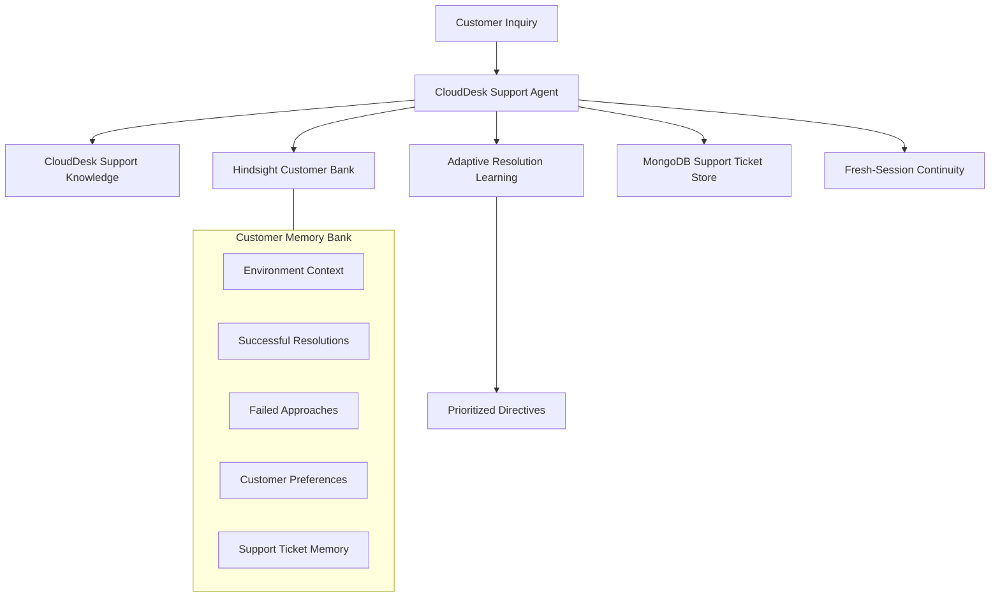

# How I Built a Support Agent That Remembers What Worked

## The Problem: Every Support Conversation Starts From Zero

Automated customer support tools are notoriously forgetful. When a customer troubleshoots an issue, tries four diagnostic steps, discovers three failed, and finally resolves it, all of that context evaporates once the session closes. Returning two days later, they are greeted as a stranger: asked for their operating system again and told to retry the exact step that already failed.

Relying solely on conversation history—the rolling window of chat turns passed in the prompt—is fundamentally insufficient:
1. **It is transient:** When a session ends or resets, conversational context is lost.
2. **It does not scale:** Passing dozens of prior turns into an LLM window causes token bloat, latency spikes, and degraded prompt adherence.
3. **It lacks semantic structure:** Raw transcripts mix pleasantries with diagnostic facts, forcing the model to re-parse the dialogue each turn.

To build a reliable assistant, I separated the agent's context into four architectural layers:
- **Conversation History:** Short-term dialogue turns within the active session.
- **Domain Knowledge:** Static organization runbooks (CloudDesk product guides).
- **Durable Customer Memory:** Long-term customer facts, environment details (operating system, browser), and interaction preferences retained across sessions.
- **Learned Troubleshooting Behavior:** Structured intelligence derived from past outcomes—specifically which steps succeeded, which failed, and how future recommendations should adapt.

The goal was to make memory directly drive future troubleshooting: prioritizing proven solutions, eliminating dead ends, and preserving case continuity across escalations.

<!-- SCREENSHOT TODO:
Add a screenshot of the CloudDesk support dashboard showing the polished
customer conversation, Hindsight status, and Customer Memory panel.
-->

## What I Wanted the Agent to Remember

Before integrating memory, I established strict boundaries on what to retain. Storing everything creates context pollution; storing too little renders memory useless.

I designed the agent to extract and persist five specific classes of information:

1. **Client Environment Facts:** The customer's operating system (Windows 11, macOS, Linux) and browser (Chrome, Firefox, Safari), eliminating redundant triage questions.
2. **Customer Support Preferences:** Explicit constraints like preferring *"one troubleshooting step at a time"* or wanting *"concise instructions"*, which yield if the customer requests all steps at once in emergencies.
3. **Successful Troubleshooting Resolutions:** The exact canonical action that resolved an issue (e.g., disabling browser extensions resolved a dashboard crash).
4. **Failed Troubleshooting Attempts:** Every step the customer attempted that failed to resolve the problem.
5. **Support Ticket Records:** When troubleshooting fails, unresolved cases escalate to durable tickets (e.g., `CS-1001`), recording environment facts and prior failures so future sessions resume without restarting triage.

## Where Hindsight Fits

To implement persistent memory without bespoke vector storage and indexing pipelines, I integrated Hindsight. You can explore the implementation via the [Hindsight GitHub repository](https://github.com/vectorize-io/hindsight) and review the [Hindsight documentation](https://hindsight.vectorize.io/). The design follows the principles in Vectorize's guide to [Vectorize agent memory](https://vectorize.io/what-is-agent-memory).

In this architecture, Hindsight provides the persistent customer memory bank. I wrapped `@vectorize-io/hindsight-client` inside a backend service (`hindsight.service.js`) with three primary functions:

### 1. Customer-Isolated Memory Banks
Multi-tenant scoping requires strict isolation between customers. Each customer is mapped to a separate Hindsight memory bank, so retention and recall operations are scoped to that customer's bank:

```javascript
getBankId(customerId) {
  return customerId.trim().toLowerCase().replace(/[^a-z0-9_-]/g, '_');
}
```

### 2. Structured Retention (`retainMemory`)
When storing facts, the service attaches structured metadata and classification tags. A successful resolution is tagged with `['successful_resolution', 'resolution', issueTag]` alongside metadata containing the issue, attempted step, and result, distinguishing episodic narratives from actionable facts.

### 3. Enriched Semantic Recall (`recallMemory`)
In fresh sessions, the backend builds an enriched query combining the issue with semantic anchors (*"crashing previous issue troubleshooting resolution successful failed customer environment preference support ticket"*). Our application calls Hindsight's recall API with this query, and Hindsight returns relevant memories for that customer's bank, which are formatted by `formatMemoryContext` and injected into the agent prompt.

Unlike static CloudDesk support knowledge (which defines product runbooks), recalled Hindsight memories provide personal grounding of what actually occurred with this specific customer.

## Learning From Successful and Failed Troubleshooting

The central engineering challenge is reliably detecting whether a troubleshooting step worked or failed. A subtle bug I encountered early on involved naive phrase matching:

If a customer says, *"Clearing the browser cache didn't fix it,"* a naive substring search for `"fix it"` or `"fixed it"` matches the substring and misclassifies the failure as a success!

To prevent this, I built a deterministic outcome detector in `supportOutcome.service.js`:

1. **Text Normalization:** Contractions like `didn't` are standardized to `didnt`, and non-alphanumeric punctuation is stripped.
2. **Partitioned Phrase Matching:** The system evaluates mutually exclusive `FAILED_PHRASES` (`didnt work`, `didnt fix it`, `still crashing`, `failed to resolve`) against `RESOLVED_PHRASES` (`that fixed it`, `works now`, `issue is resolved`, `all good now`).
3. **Contrastive Clause Resolution:** For compound sentences (*"Clearing cache didn't fix it, but disabling extensions fixed the problem"*), the parser evaluates clause positions and conjunctions like `but` to extract the true outcome from the resolution clause.
4. **Step Extraction Asymmetry:** For successful confirmations (*"That fixed it"*), the engine references recent assistant recommendations to identify the step. For failures, the engine enforces a strict constraint: if the customer does not explicitly name the failed action, the system does not infer a step from history, avoiding falsely blacklisting innocent steps.

Once classified, `formatResolutionMemory` generates a durable Hindsight payload:
- **Success:** `"Previous dashboard loading failure was successfully resolved by disabling browser extensions."` (tagged `successful_resolution`)
- **Failure:** `"Troubleshooting step \"clearing browser cache\" did not resolve dashboard loading failure."` (tagged `failed_resolution`)

## Turning Memory Into Adaptive Troubleshooting

Storing memories is only half the solution; they must actively adapt troubleshooting strategy. In `supportResolutionLearning.service.js`, I built an adaptive prioritization engine that inspects recalled memories before the LLM generates a response:

1. **Chronological Tracking:** Memories are sorted by timestamp so newer outcomes override older ones.
2. **Canonical Step Mapping:** Variations (*"extensions"*, *"ad blocker"*, *"plugin"*) map to canonical actions (`disabling browser extensions`).
3. **Blacklisting Failed Approaches:** Any step with a failure count is placed on an avoided steps list.
4. **Hierarchical Prioritization:**
   - **Priority A (Customer Success):** A step that previously resolved this issue for this specific customer.
   - **Priority B (Environment Success):** A step that resolved issues on the customer's matching operating system or browser.
   - **Priority C (Official Knowledge Base):** CloudDesk procedures from `supportKnowledge.service.js`, filtered to exclude steps on the customer's avoided list.
   - **Priority D (Untried Fallbacks):** Standard fallback procedures not yet attempted.
5. **Outcome Reversal:** If a step that previously worked later fails (e.g., switching to UDP port 1194 fails when an ISP blocks UDP), the latest failure supersedes past success and moves the step to the blacklist.

The agent executes this learning service on every turn in `agent.service.js`:

```javascript
const solutionPrioritization = supportResolutionLearningService.prioritizeSolutions({
  issue: currentIssue,
  environment: detectedEnv,
  knowledgeDocs,
  memories: recallResult?.memories || [],
});

const adaptiveDirective = supportResolutionLearningService.generateAdaptiveDirective(solutionPrioritization);
```

The generated directive explicitly commands the LLM:
```text
[ADAPTIVE TROUBLESHOOTING INTELLIGENCE & SOLUTION PRIORITIZATION]:
- Primary Recommended Approach: "disabling browser extensions" (Priority: CUSTOMER_SUCCESS)
- Decision Rationale: Previously successful for this customer on dashboard loading failure.
- STRICTLY AVOID Previously Failed Approaches: "clearing browser cache"
```

This prevents the LLM from relying on generic probabilistic completions and forces it to honor empirical customer history.

<!-- SCREENSHOT TODO:
Add a screenshot showing Learned Support Behavior with a previously
successful approach and a previously failed/avoided approach.
-->

## Customer Preferences

Customers have diverse support styles. In `supportPreference.service.js`, the agent detects and extracts durable preferences across three verified categories:
- **Troubleshooting Style:** Prefers one troubleshooting step at a time versus a full list.
- **Communication Style:** Prefers concise instructions without conversational pleasantries.
- **Technical Level:** Advanced background (skips basic background explanations) versus detailed step-by-step guidance.

When detected, preferences are stored in Hindsight with tag `preference` and formatted into active directives during prompt assembly. However, real support requires flexibility: if a customer with a stored "one step at a time" preference states they are in a rush and asks for all steps immediately, the current message must override the stored memory.

To handle this, `detectOverride` inspects the user message against explicit override patterns:

```javascript
detectOverride(userMessage = '') {
  if (!userMessage || typeof userMessage !== 'string') {
    return { hasOverride: false, overrideType: null };
  }

  for (const pattern of OVERRIDE_PATTERNS) {
    if (pattern.test(userMessage.trim())) {
      return {
        hasOverride: true,
        overrideType: 'all_steps_requested',
      };
    }
  }

  return { hasOverride: false, overrideType: null };
}
```

When an override is detected, the agent bypasses the step-by-step constraint for that turn while leaving the durable preference intact for future sessions.

## Persistent Support Tickets

Automated troubleshooting cannot solve every technical failure. When diagnostic steps are exhausted without resolution, forcing a customer through repetitive chat loops breaks trust.

In `supportTicket.service.js`, when repeated attempts fail, the agent triggers automated ticket escalation:
1. It records a structured ticket in MongoDB (`supportTicket.model.js`) with an identifier like `CS-1001`, logging customer ID, environment, escalation reason, and all attempted steps. MongoDB provides authoritative persistence across backend restarts.
2. It simultaneously writes a `support_ticket` memory to Hindsight.
3. In future sessions, when the customer mentions the ticket or issue, the agent acknowledges ticket `CS-1001`, confirms its escalated status, and references previously failed steps so the customer is not asked to repeat them.

<!-- SCREENSHOT TODO:
Add a screenshot showing the support ticket and fresh-session continuity.
-->

## A Concrete Before/After Example

The practical difference between a stateless assistant and this memory agent is demonstrated in our evaluation and demo workflows:

### Before (Stateless Support):
A customer reports that CloudDesk reports fail to load. The agent suggests clearing browser cache. Two days later, in a new chat session, the customer returns with the same issue. The stateless bot asks for their OS and browser again, suggests clearing browser cache a second time, and has no record of the previous troubleshooting.

### After (Memory-Enabled Workflow):
1. **Initial Issue:** Customer reports reports fail to load on Chrome/Windows 11.
2. **Outcome Learned:** Customer confirms clearing browser cache worked; Hindsight retains `successful_resolution`.
3. **Fresh Session:** Session resets with empty history. The customer reports the issue recurring.
4. **Prioritization:** The agent recalls the past success and prioritizes clearing browser cache immediately without re-asking environment facts.
5. **Reversal & Avoidance:** The customer reports cache clearing failed this time. The agent registers the failure, marks cache clearing as avoided, and switches to reducing date range filters.
6. **Ticket Escalation & Continuity:** With repeated failure, ticket `CS-1001` is created in MongoDB and recorded in Hindsight.
7. **Cross-Session Recall:** In a subsequent fresh session, the customer asks for a status update. The agent acknowledges `CS-1001`, notes its escalated status, and avoids repeating the failed cache attempt.

## Architecture

The system connects user chat interactions with both durable document storage and episodic memory banks:



<!-- ARCHITECTURE DIAGRAM TODO:
Create an architecture diagram showing the verified flow between
Customer → Support Agent → Hindsight Memory / Support Knowledge →
Adaptive Resolution Learning → MongoDB Support Tickets →
Fresh-session continuity.
-->

## What I Learned

Building this agent highlighted key engineering takeaways:

1. **Memory is valuable when it alters decisions:** Storing conversations as passive logs adds little value. Memory becomes impactful when it deterministically re-orders troubleshooting steps and prevents repeated mistakes.
2. **Failed outcomes matter as much as successes:** Blacklisting an approach that failed is often more critical for customer experience than repeating an approach that worked.
3. **Current intent must supersede history:** Stored preferences should guide default behavior, but explicit user requests in the current turn must take precedence.
4. **Different stores for different access patterns:** Hindsight provides semantic retrieval for unstructured context, while MongoDB provides reliable transactional state for support tickets.

## Limitations and Tradeoffs

While effective for the supported workflows, the current implementation has specific boundaries:

- **Phrase-Based Outcome Detection:** Outcome classification relies on deterministic keyword and regex matching. Unconventional phrasing or ambiguous feedback may not be detected as an outcome.
- **Service Dependencies:** The architecture depends on external availability of Hindsight Cloud for memory recall, MongoDB for ticket persistence, and Google Gemini for language generation.
- **Domain Scope:** The current implementation is scoped to technical desktop and web support scenarios, rather than generalized customer service.

## Conclusion

Stateless support bots repeatedly frustrate users by treating every conversation as day one. By integrating customer-isolated Hindsight memory banks, deterministic outcome detection, and adaptive solution prioritization, the CloudDesk support agent bridges the gap between individual sessions. Instead of starting from scratch each session, the agent can recall previous outcomes, avoid known failed approaches, and continue unresolved cases through persistent support tickets.
